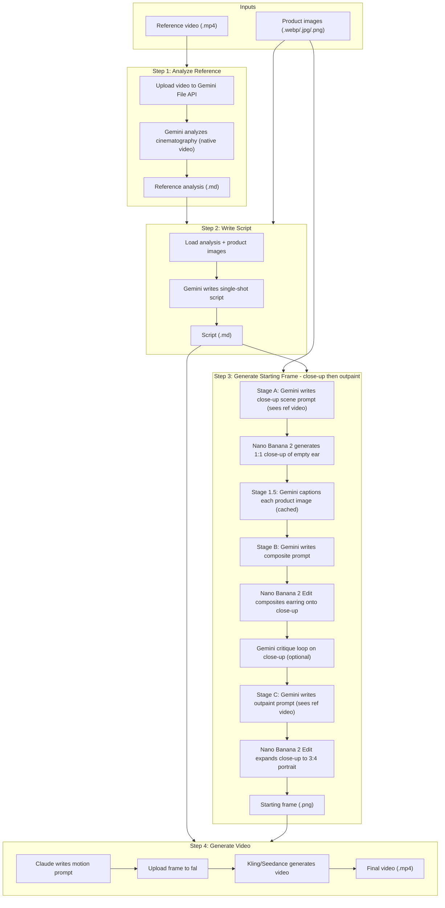

# Video Generation Pipeline

End-to-end pipeline that takes product images and a reference video and produces a finished video advertisement.

## Overview

The pipeline runs four steps in sequence. Each step can also be run independently.



## Prerequisites

### API keys

You need accounts and API keys for:

| Service    | Environment Variable   | Used For                              |
|------------|------------------------|---------------------------------------|
| Google     | `GEMINI_API_KEY`       | Gemini (analysis, script, scene prompt, composite prompt, critique) |
| Anthropic  | `ANTHROPIC_API_KEY`    | Claude (video motion prompt only) |
| Fal.ai     | `FAL_KEY`              | Nano Banana 2 (images), Kling/Seedance (video) |

Copy `.env.example` to `.env` and fill in your keys:

```bash
cp .env.example .env
```

### Environment setup

```bash
uv sync
```

## Quick Start

### Full pipeline (with reference video)

```bash
uv run python -m video_generation \
  --product-dir data/inputs/jewelry/product \
  --reference-video data/inputs/jewelry/reference/yurman-full-shot.mp4
```

### Full pipeline (skip analysis, use existing .md)

```bash
uv run python -m video_generation \
  --product-dir data/inputs/jewelry/product \
  --reference-analysis data/inputs/jewelry/reference/yurman-full-shot-analysis.md
```

### Run a single step

```bash
uv run python -m video_generation \
  --step analyze \
  --product-dir data/inputs/jewelry/product \
  --reference-video data/inputs/jewelry/reference/yurman-full-shot.mp4
```

Single-step invocations create or resume the run that the inputs would belong
to. Because cached step outputs short-circuit execution, downstream steps
(`script`, `frame`, `video`) automatically run any missing upstream steps for
you. To force a step to re-execute, change a parameter (e.g.
`--max-refinements`) or pass a fresh `--variant` tag.

## Runs, content IDs, and storage

Every artifact the pipeline touches — inputs and step outputs alike — is
stored content-addressed (sha256-keyed) in a pluggable `Storage` backend.
A *run* is a deterministic record of `(inputs by role, params, code version)`
and the per-step outputs each invocation produced.

- Storage selection: `--storage local:./data` (default) or
  `--storage gdrive:<folder-id>`.
- Run id derivation: `sha256(canonical_json({inputs, params, code_version}))[:16]`.
  Same triple → same run id → resumable, idempotent re-execution.
- Fork the same triple: `--variant <tag>` to register a sibling run.

See [storage-and-runs.md](storage-and-runs.md) for the full content-store
layout, manifest schema, Google Drive setup, and the helper scripts under
`scripts/` (`migrate_to_library.py`, `precaption_products.py`,
`compare_edit_models.py`).

### Browsing a run on disk

```
data/
├── library/                       # Content-addressed blobs
│   └── <aa>/<sha256><ext>
│   └── <aa>/<sha256>.meta.json
│   └── <aa>/<sha256>.caption.json # Gemini caption sidecar (product images)
└── runs/<run_id>/
    ├── manifest.json              # Inputs, params, code_version, step records
    └── steps/
        ├── analyze/analysis.md
        ├── script/script.md
        ├── frame/closeup_scene_prompt.txt        # Stage A prompt
        ├── frame/closeup_scene.png               # Stage A image (no jewellery)
        ├── frame/product_captions.json           # Stage 1.5 captions
        ├── frame/composite_prompt.txt            # Stage B prompt
        ├── frame/closeup_composite_v0.png        # Stage B initial composite
        ├── frame/critique_v{i}.json              # Stage B critique iterations
        ├── frame/closeup_composite_v{i}.png      # Stage B refined composites
        ├── frame/closeup_composite_final.png     # Stage B accepted close-up
        ├── frame/expand_prompt.txt               # Stage C outpaint prompt
        ├── frame/starting_frame.png              # Stage C outpainted final frame
        └── video/{motion_prompt.txt, video.mp4}
```

## Pipeline Steps

### Step 1: Analyze Reference

**Module:** `video_generation.steps.analyze_reference`

Uploads the reference video to the Gemini File API for native video understanding (processed at 1 FPS + audio), then asks Gemini for a professional cinematography breakdown covering shot type, camera movement, lighting, and pacing.

| | |
|---|---|
| **External services** | Gemini (Google) |
| **Input** | Reference video (`.mp4`) |
| **Output** | `{video_stem}-analysis.md` in the output directory |
| **Prompts used** | `system/video_analyst.txt`, `examples/shot_breakdown_request.txt` |

### Step 2: Write Script

**Module:** `video_generation.steps.write_script`

Reads the reference analysis and product images, then asks Gemini 3.1 Pro
(multimodal) to write a single continuous shot script that emulates the
reference style while showcasing the product. Product images are sent inline
as JPEG `Part`s; the analysis is inlined as text.

| | |
|---|---|
| **External services** | Gemini 3.1 Pro (Google) |
| **Input** | Reference analysis (`.md`), product image content ids |
| **Output** | `script.md` (recorded as content + convenience copy under `runs/<run_id>/steps/script/`) |
| **Prompts used** | `system/script_writer.txt`, `examples/emulate_reference_script.txt` |

### Step 3: Generate Starting Frame

**Module:** `video_generation.steps.generate_starting_frame`

Three-stage image generation built around a *close-up then outpaint* strategy.
The earlier "single full-portrait composite + critique loop" approach kept
running into Nano Banana 2 Edit's bias against shrinking small objects: a
~4 mm earring on a 3:4 portrait is only a few dozen pixels tall, and the
editor would not converge on the correct size no matter how aggressive the
critique. Generating the close-up first sidesteps that bias by giving the
editor a canvas where the earring is naturally one of the dominant objects;
the final 3:4 portrait is then produced in a single deterministic outpaint.

**Stage A — generate the close-up scene (no jewellery).**

1. **Gemini 3.1 Pro** writes a *close-up* scene prompt (extreme 1:1 crop of the
   model's ear, earlobe, and surrounding skin). When a reference video is
   registered, the video is uploaded to the Gemini File API and attached so
   Gemini can match its opening frame's lighting, skin tone, and styling.
2. **Nano Banana 2** (text-to-image, 1:1, `NANO_BANANA_RESOLUTION=2K`) renders
   that close-up.

**Stage 1.5 — caption every product image (cached forever).**

3. **Gemini 3.1 Pro** independently captions each unique product image with a
   one-sentence description that names its role (front view, side view,
   on-model size reference, etc.). Captions are persisted as
   `library/<aa>/<sha>.caption.json` sidecars in the content store, so once
   generated they are reused by every subsequent run for that exact image.

**Stage B — composite earring onto the close-up + critique loop.**

4. **Gemini 3.1 Pro** (`thinking_level=HIGH`) writes the composite prompt by
   jointly looking at the captioned close-up scene and all captioned product
   reference images.
5. **Nano Banana 2 Edit** (1:1, 2K) composites the earring onto the close-up.
6. *(Optional)* **Gemini 3.1 Pro** critiques the composite against the
   captioned product references via a structured `CompositesCritique` JSON
   schema and emits a correction prompt. The editor re-runs with
   `[current_composite, *all_product_references]` as input images so the
   correction has anchors. The loop iterates up to `--max-refinements` times.

**Stage C — outpaint the accepted close-up to the final 3:4 portrait.**

7. **Gemini 3.1 Pro** (`thinking_level=HIGH`) writes a single outpaint
   instruction grounded in the close-up composite + (optional) reference
   video / analysis. The instruction tells the editor to PRESERVE every
   pixel of the close-up region exactly and INVENT only the surrounding
   head, hair, shoulders, and background to match the reference framing.
8. **Nano Banana 2 Edit** (3:4, 2K) expands the canvas in one shot. There is
   no critique loop on this stage by design.

| | |
|---|---|
| **External services** | Gemini 3.1 Pro (close-up scene prompt, captions, composite prompt, critique, expand prompt), Nano Banana 2 + Nano Banana 2 Edit (fal.ai) |
| **Input** | Script content id, product image content ids, optional reference video + analysis content ids |
| **Output** | `starting_frame.png` (final 3:4 outpainted), `closeup_scene.png` + `closeup_scene_prompt.txt`, `product_captions.json`, `composite_prompt.txt`, per-iteration `closeup_composite_v{i}.png` + `critique_v{i}.json`, `closeup_composite_final.png`, `expand_prompt.txt` |
| **Prompts used** | `examples/closeup_scene_without_product.txt` (Stage A), `examples/caption_product_image.txt` (Stage 1.5), `examples/write_composite_prompt.txt` + `examples/critique_composite.txt` (Stage B), `examples/expand_to_full_frame.txt` (Stage C) |

### Step 4: Generate Video

**Module:** `video_generation.steps.generate_video`

Claude writes a short motion prompt from the script and starting frame, then the video model animates the frame.

| | |
|---|---|
| **External services** | Claude (Anthropic), Kling or Seedance (fal.ai) |
| **Input** | Starting frame (`.png`), script text |
| **Output** | `video_*.mp4` in `output_dir/videos/` |
| **Prompts used** | `examples/video_motion_prompt.txt` |

## Configuration

| Flag | Default | Description |
|---|---|---|
| `--product-dir` | *(required)* | Directory containing product images (auto-registered into the content store) |
| `--reference-video` | `None` | Reference video to analyze (auto-registered) |
| `--reference-analysis` | `None` | Existing analysis file (skips step 1) |
| `--storage` | `local:./data` | Storage spec; `local:<path>` or `gdrive:<folder-id>` |
| `--run-id` | `None` | Inspect/resume a specific run id |
| `--variant` | `""` | Fork tag added to params; same inputs/code with a different variant fork into a new run id |
| `--output-dir` | `data/outputs` | (Legacy) Outputs are now under `<storage>/runs/<run_id>/steps/` |
| `--edit-model` | `fal-ai/nano-banana-2/edit` | Fal endpoint for image editing — used by **both** Stage B (composite + critique corrections, 1:1) and Stage C (outpaint to 3:4). The code branches on the model id and supports `nano-banana`, `gpt-image`, `flux-pro/kontext`, and Seedream-family endpoints. The Stage A *text-to-image* model is currently hard-coded to `fal-ai/nano-banana-2` (separate constant `BASE_SCENE_TEXT_TO_IMAGE`). |
| `--video-model` | `fal-ai/kling-video/v2.6/pro/image-to-video` | Fal endpoint for video generation |
| `--video-duration` | `"5"` | Video length in seconds |
| `--claude-model` | `claude-sonnet-4-20250514` | Claude model id (used only by the video motion-prompt step) |
| `--gemini-model` | `gemini-3.1-pro-preview` | Gemini model id (analysis, script, scene prompt, composite prompt, critique) |
| `--max-refinements` | `3` | Max critique-and-correct iterations during **Stage B only** (close-up composite). Stage C (outpaint) is single-shot regardless. Pass `0` to skip the Stage B critique loop. |
| `--num-frames` | `20` | Unused (kept for backward compatibility) |
| `--step` | `None` | Run single step: `analyze`, `script`, `frame`, `video` |
| `-v` / `--verbose` | `False` | Enable debug logging |

To use Seedance instead of Kling:

```bash
--video-model fal-ai/bytedance/seedance/v1.5/pro/image-to-video
```

## Architecture

```
src/video_generation/
├── __init__.py          # Package exports
├── __main__.py          # CLI entry point (argparse)
├── config.py            # PipelineConfig + result dataclasses
├── pipeline.py          # Orchestrator: run_pipeline(), run_step()
├── clients/             # API client setup (Anthropic, Gemini)
├── media/               # Display and storage utilities
├── prompts/             # Prompt loading from data/prompts/
├── store/               # Content + Run + Storage layer
│   ├── models.py        #   ContentMeta, RunRecord, StepRecord, ...
│   ├── storage.py       #   Storage Protocol + LocalStorage
│   ├── gdrive.py        #   GoogleDriveStorage (stub)
│   ├── factory.py       #   make_storage("local:...", "gdrive:...")
│   ├── content.py       #   ContentStore (sha256-keyed blob registry)
│   ├── runs.py          #   RunStore (manifest + step records)
│   ├── context.py       #   StepContext (per-step recording facade)
│   └── code_version.py  #   current_code_version() via git
└── steps/
    ├── analyze_reference.py
    ├── write_script.py
    ├── generate_starting_frame.py
    └── generate_video.py
```

Each step takes a `StepContext` and the content ids of its inputs. It loads
input bytes from the `ContentStore`, performs its work, and registers each
output (intermediate + final) back into the store with `produced_by` pointing
at this run+step. The orchestrator in `pipeline.py` is idempotent: completed
steps are skipped on re-run, partial work resumes.

### Gemini call configuration

All Gemini calls in the pipeline (analysis, script, scene prompt, composite
prompt, captioning, critique) explicitly set:

```python
config=types.GenerateContentConfig(
    thinking_config=types.ThinkingConfig(
        thinking_level=types.ThinkingLevel.LOW   # or HIGH for composite
    ),
)
```

`ThinkingLevel.LOW` is required because Gemini 3.1 Pro Preview enables a
"thinking" stage by default that can consume thousands of tokens *before* the
final output. Without an explicit level, partial scratchpad contents leak
into `response.text`. The composite-prompt step uses `HIGH` because the
visual analysis (size estimation, design transcription) is exactly what
produces a high-fidelity edit prompt.

We deliberately do **not** set `max_output_tokens`. Output length is
controlled by the prompts themselves (e.g. captioning enforces "one
sentence, max 30 words"; the composite prompt asks for "one dense paragraph,
~6–10 sentences" + structured DO / DO NOT lists; the critique returns a
schema-constrained JSON object). Hard token caps were causing mid-sentence
truncations under `ThinkingLevel.HIGH`; letting the prompt do the work is
both shorter code and more predictable behaviour.

## Prompt Templates

All prompts live in `data/prompts/` and are loaded by the `video_generation.prompts` module.

### System prompts (`data/prompts/system/`)

| File | Used by |
|---|---|
| `video_analyst.txt` | Step 1 (analyze reference) |
| `script_writer.txt` | Step 2 (write script) |
| `assistant.txt` | General-purpose (not used in pipeline) |

### Example prompts (`data/prompts/examples/`)

| File | Used by |
|---|---|
| `shot_breakdown_request.txt` | Step 1 (analyze reference) |
| `emulate_reference_script.txt` | Step 2 (write script) |
| `closeup_scene_without_product.txt` | Step 3 / Stage A (close-up scene prompt — also receives reference video binary when provided) |
| `caption_product_image.txt` | Step 3 / Stage 1.5 (one-sentence content-tied caption per product image, results cached as `library/<aa>/<sha>.caption.json`) |
| `write_composite_prompt.txt` | Step 3 / Stage B (composite prompt from close-up + captioned product images) |
| `critique_composite.txt` | Step 3 / Stage B critique (structured critique of close-up composite, only when `--max-refinements > 0`) |
| `expand_to_full_frame.txt` | Step 3 / Stage C (outpaint instruction expanding the close-up to the final 3:4 portrait) |
| `video_motion_prompt.txt` | Step 4 (motion prompt for the video model) |
| `starting_frame_prompt.txt` | Not used in pipeline (notebook legacy) |
| `locate_ear_region.txt` | Not used in pipeline (notebook legacy) |
| `analyze_product.txt` | Not used in pipeline (notebook legacy) |
| `image_generation.txt` | Not used in pipeline (example) |
| `video_generation.txt` | Not used in pipeline (example) |
