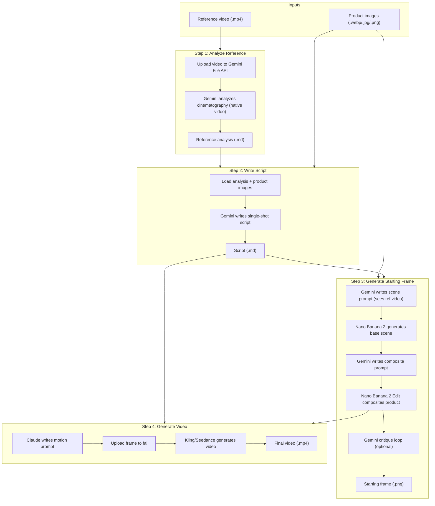

# Video Generation Pipeline

End-to-end pipeline that takes product images and a reference video and produces a finished video advertisement.

## Overview

The pipeline runs four steps in sequence. Each step can also be run independently.



## Prerequisites

### API keys

You need accounts and API keys for:

| Service    | Environment Variable   | Used For                              |
|------------|------------------------|---------------------------------------|
| Google     | `GEMINI_API_KEY`       | Gemini (analysis, script, scene prompt, composite prompt, critique) |
| Anthropic  | `ANTHROPIC_API_KEY`    | Claude (video motion prompt only) |
| Fal.ai     | `FAL_KEY`              | Nano Banana 2 (images), Kling/Seedance (video) |

Copy `.env.example` to `.env` and fill in your keys:

```bash
cp .env.example .env
```

### Environment setup

```bash
uv sync
```

## Quick Start

### Full pipeline (with reference video)

```bash
uv run python -m video_generation \
  --product-dir data/inputs/jewelry/product \
  --reference-video data/inputs/jewelry/reference/yurman-full-shot.mp4
```

### Full pipeline (skip analysis, use existing .md)

```bash
uv run python -m video_generation \
  --product-dir data/inputs/jewelry/product \
  --reference-analysis data/inputs/jewelry/reference/yurman-full-shot-analysis.md
```

### Run a single step

```bash
uv run python -m video_generation \
  --step analyze \
  --product-dir data/inputs/jewelry/product \
  --reference-video data/inputs/jewelry/reference/yurman-full-shot.mp4
```

Single-step invocations create or resume the run that the inputs would belong
to. Because cached step outputs short-circuit execution, downstream steps
(`script`, `frame`, `video`) automatically run any missing upstream steps for
you. To force a step to re-execute, change a parameter (e.g.
`--max-refinements`) or pass a fresh `--variant` tag.

## Runs, content IDs, and storage

Every artifact the pipeline touches — inputs and step outputs alike — is
stored content-addressed (sha256-keyed) in a pluggable `Storage` backend.
A *run* is a deterministic record of `(inputs by role, params, code version)`
and the per-step outputs each invocation produced.

- Storage selection: `--storage local:./data` (default) or
  `--storage gdrive:<folder-id>`.
- Run id derivation: `sha256(canonical_json({inputs, params, code_version}))[:16]`.
  Same triple → same run id → resumable, idempotent re-execution.
- Fork the same triple: `--variant <tag>` to register a sibling run.

See [storage-and-runs.md](storage-and-runs.md) for the full content-store
layout, manifest schema, and Google Drive setup.

### Browsing a run on disk

```
data/
├── library/                       # Content-addressed blobs
│   └── <aa>/<sha256><ext>
│   └── <aa>/<sha256>.meta.json
└── runs/<run_id>/
    ├── manifest.json              # Inputs, params, code_version, step records
    └── steps/
        ├── analyze/analysis.md
        ├── script/script.md
        ├── frame/scene_prompt.txt
        ├── frame/composite_prompt.txt
        ├── frame/starting_frame_v0.png
        ├── frame/critique_v1.json
        ├── frame/starting_frame.png
        └── video/{motion_prompt.txt, video.mp4}
```

## Pipeline Steps

### Step 1: Analyze Reference

**Module:** `video_generation.steps.analyze_reference`

Uploads the reference video to the Gemini File API for native video understanding (processed at 1 FPS + audio), then asks Gemini for a professional cinematography breakdown covering shot type, camera movement, lighting, and pacing.

| | |
|---|---|
| **External services** | Gemini (Google) |
| **Input** | Reference video (`.mp4`) |
| **Output** | `{video_stem}-analysis.md` in the output directory |
| **Prompts used** | `system/video_analyst.txt`, `examples/shot_breakdown_request.txt` |

### Step 2: Write Script

**Module:** `video_generation.steps.write_script`

Reads the reference analysis and product images, then asks Gemini 3.1 Pro
(multimodal) to write a single continuous shot script that emulates the
reference style while showcasing the product. Product images are sent inline
as JPEG `Part`s; the analysis is inlined as text.

| | |
|---|---|
| **External services** | Gemini 3.1 Pro (Google) |
| **Input** | Reference analysis (`.md`), product image content ids |
| **Output** | `script.md` (recorded as content + convenience copy under `runs/<run_id>/steps/script/`) |
| **Prompts used** | `system/script_writer.txt`, `examples/emulate_reference_script.txt` |

### Step 3: Generate Starting Frame

**Module:** `video_generation.steps.generate_starting_frame`

Multi-stage image generation with an optional iterative refinement loop:

1. **Gemini 3.1 Pro** writes a scene prompt for an empty-eared model. When a
   reference video is registered, the video is uploaded to the Gemini File API
   and attached to the call so Gemini can match its opening frame's
   cinematography (lens, lighting, pose, framing).
2. **Nano Banana 2** (Google Gemini 3.1 Flash Image, via fal) generates the
   base scene from that prompt (text-to-image, 3:4 portrait).
3. **Gemini 3.1 Pro** writes a composite prompt by jointly looking at the base
   scene and all product reference images.
4. **Nano Banana 2 Edit** composites the product onto the scene.
5. *(Optional, off by default if `--max-refinements 0`)* **Gemini 3.1 Pro**
   critiques the composite against the product references via a structured
   `CompositesCritique` JSON schema and emits a correction prompt; the editor
   re-runs up to `--max-refinements` times.

> Note on the critique loop: Nano Banana 2 Edit's first composite is usually
> excellent. The critique loop, with the existing aggressive prompt, tends to
> demand cumulative shrinkage and degrades quality on each iteration. Set
> `--max-refinements 0` to disable it (recommended default until the critic
> prompt is rewritten to detect over-correction). See
> [storage-and-runs.md](storage-and-runs.md) for full step-output schema.

| | |
|---|---|
| **External services** | Gemini 3.1 Pro (scene prompt, composite prompt, critique), Nano Banana 2 + Nano Banana 2 Edit (fal.ai) |
| **Input** | Script content id, product image content ids, optional reference video + analysis content ids |
| **Output** | `starting_frame.png` (final) plus per-iteration `starting_frame_v{i}.png`, `scene_prompt.txt`, `base_scene.png`, `composite_prompt.txt`, `critique_v{i}.json` |
| **Prompts used** | `examples/scene_without_product.txt`, `examples/write_composite_prompt.txt`, `examples/critique_composite.txt` |

### Step 4: Generate Video

**Module:** `video_generation.steps.generate_video`

Claude writes a short motion prompt from the script and starting frame, then the video model animates the frame.

| | |
|---|---|
| **External services** | Claude (Anthropic), Kling or Seedance (fal.ai) |
| **Input** | Starting frame (`.png`), script text |
| **Output** | `video_*.mp4` in `output_dir/videos/` |
| **Prompts used** | `examples/video_motion_prompt.txt` |

## Configuration

| Flag | Default | Description |
|---|---|---|
| `--product-dir` | *(required)* | Directory containing product images (auto-registered into the content store) |
| `--reference-video` | `None` | Reference video to analyze (auto-registered) |
| `--reference-analysis` | `None` | Existing analysis file (skips step 1) |
| `--storage` | `local:./data` | Storage spec; `local:<path>` or `gdrive:<folder-id>` |
| `--run-id` | `None` | Inspect/resume a specific run id |
| `--variant` | `""` | Fork tag added to params; same inputs/code with a different variant fork into a new run id |
| `--output-dir` | `data/outputs` | (Legacy) Outputs are now under `<storage>/runs/<run_id>/steps/` |
| `--edit-model` | `fal-ai/nano-banana-2/edit` | Fal endpoint for image editing/compositing (the code branches on `"nano-banana"` vs Seedream so flipping back via this flag still works) |
| `--video-model` | `fal-ai/kling-video/v2.6/pro/image-to-video` | Fal endpoint for video generation |
| `--video-duration` | `"5"` | Video length in seconds |
| `--claude-model` | `claude-sonnet-4-20250514` | Claude model id (used only by the video motion-prompt step) |
| `--gemini-model` | `gemini-3.1-pro-preview` | Gemini model id (analysis, script, scene prompt, composite prompt, critique) |
| `--max-refinements` | `3` | Max critique-and-correct iterations during starting-frame generation. Pass `0` to skip the critique loop entirely (often higher quality with Nano Banana 2). |
| `--num-frames` | `20` | Unused (kept for backward compatibility) |
| `--step` | `None` | Run single step: `analyze`, `script`, `frame`, `video` |
| `-v` / `--verbose` | `False` | Enable debug logging |

To use Seedance instead of Kling:

```bash
--video-model fal-ai/bytedance/seedance/v1.5/pro/image-to-video
```

## Architecture

```
src/video_generation/
├── __init__.py          # Package exports
├── __main__.py          # CLI entry point (argparse)
├── config.py            # PipelineConfig + result dataclasses
├── pipeline.py          # Orchestrator: run_pipeline(), run_step()
├── clients/             # API client setup (Anthropic, Gemini)
├── media/               # Display and storage utilities
├── prompts/             # Prompt loading from data/prompts/
├── store/               # Content + Run + Storage layer
│   ├── models.py        #   ContentMeta, RunRecord, StepRecord, ...
│   ├── storage.py       #   Storage Protocol + LocalStorage
│   ├── gdrive.py        #   GoogleDriveStorage (stub)
│   ├── factory.py       #   make_storage("local:...", "gdrive:...")
│   ├── content.py       #   ContentStore (sha256-keyed blob registry)
│   ├── runs.py          #   RunStore (manifest + step records)
│   ├── context.py       #   StepContext (per-step recording facade)
│   └── code_version.py  #   current_code_version() via git
└── steps/
    ├── analyze_reference.py
    ├── write_script.py
    ├── generate_starting_frame.py
    └── generate_video.py
```

Each step takes a `StepContext` and the content ids of its inputs. It loads
input bytes from the `ContentStore`, performs its work, and registers each
output (intermediate + final) back into the store with `produced_by` pointing
at this run+step. The orchestrator in `pipeline.py` is idempotent: completed
steps are skipped on re-run, partial work resumes.

### Gemini call configuration

All Gemini calls in the pipeline (analysis, script, scene prompt, composite
prompt, critique) explicitly set:

```python
config=types.GenerateContentConfig(
    max_output_tokens=...,                  # generous budgets, see below
    thinking_config=types.ThinkingConfig(
        thinking_level=types.ThinkingLevel.LOW
    ),
)
```

`ThinkingLevel.LOW` is required because Gemini 3.1 Pro Preview enables a
"thinking" stage by default that can consume thousands of tokens *before* the
final output. Without an explicit level, the model can blow through the
output budget while still reasoning, and partial scratchpad contents leak
into `response.text`.

Per-call output budgets:

| Step | `max_output_tokens` |
|---|---|
| `analyze` | 8192 |
| `script` | 8192 |
| `frame` — scene prompt | 4096 |
| `frame` — composite prompt | 4096 |
| `frame` — critique (structured JSON) | 2048 |

## Prompt Templates

All prompts live in `data/prompts/` and are loaded by the `video_generation.prompts` module.

### System prompts (`data/prompts/system/`)

| File | Used by |
|---|---|
| `video_analyst.txt` | Step 1 (analyze reference) |
| `script_writer.txt` | Step 2 (write script) |
| `assistant.txt` | General-purpose (not used in pipeline) |

### Example prompts (`data/prompts/examples/`)

| File | Used by |
|---|---|
| `shot_breakdown_request.txt` | Step 1 (analyze reference) |
| `emulate_reference_script.txt` | Step 2 (write script) |
| `scene_without_product.txt` | Step 3a (scene prompt — also receives reference video binary when provided) |
| `write_composite_prompt.txt` | Step 3b (composite prompt from scene + product images) |
| `critique_composite.txt` | Step 3c (structured critique of composite, only when `--max-refinements > 0`) |
| `video_motion_prompt.txt` | Step 4 (motion prompt for the video model) |
| `starting_frame_prompt.txt` | Not used in pipeline (notebook legacy) |
| `locate_ear_region.txt` | Not used in pipeline (notebook legacy) |
| `image_generation.txt` | Not used in pipeline (example) |
| `video_generation.txt` | Not used in pipeline (example) |
