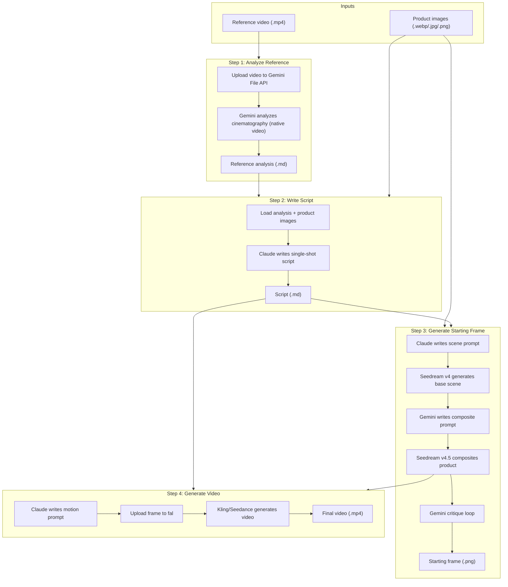

# Video Generation Pipeline

End-to-end pipeline that takes product images and a reference video and produces a finished video advertisement.

## Overview

The pipeline runs four steps in sequence. Each step can also be run independently.



## Prerequisites

### API keys

You need accounts and API keys for:

| Service    | Environment Variable   | Used For                              |
|------------|------------------------|---------------------------------------|
| Anthropic  | `ANTHROPIC_API_KEY`    | Claude (script, scene prompt, motion prompt) |
| Google     | `GEMINI_API_KEY`       | Gemini (video analysis, composite prompt, critique) |
| Fal.ai     | `FAL_KEY`              | Seedream (images), Kling/Seedance (video) |

Copy `.env.example` to `.env` and fill in your keys:

```bash
cp .env.example .env
```

### Environment setup

```bash
uv sync
```

## Quick Start

### Full pipeline (with reference video)

```bash
uv run python -m video_generation \
  --product-dir data/inputs/jewelry/product \
  --reference-video data/inputs/jewelry/reference/yurman-full-shot.mp4
```

### Full pipeline (skip analysis, use existing .md)

```bash
uv run python -m video_generation \
  --product-dir data/inputs/jewelry/product \
  --reference-analysis data/inputs/jewelry/reference/yurman-full-shot-analysis.md
```

### Run a single step

```bash
# Analyze a reference video
uv run python -m video_generation \
  --step analyze \
  --product-dir data/inputs/jewelry/product \
  --reference-video data/inputs/jewelry/reference/yurman-full-shot.mp4

# Write a script (requires analysis to exist)
uv run python -m video_generation \
  --step script \
  --product-dir data/inputs/jewelry/product \
  --reference-analysis data/inputs/jewelry/reference/yurman-full-shot-analysis.md

# Generate starting frame (requires script.md in output dir)
uv run python -m video_generation \
  --step frame \
  --product-dir data/inputs/jewelry/product \
  --reference-analysis data/inputs/jewelry/reference/yurman-full-shot-analysis.md

# Generate video (requires script.md and starting frame in output dir)
uv run python -m video_generation \
  --step video \
  --product-dir data/inputs/jewelry/product \
  --reference-analysis data/inputs/jewelry/reference/yurman-full-shot-analysis.md
```

## Pipeline Steps

### Step 1: Analyze Reference

**Module:** `video_generation.steps.analyze_reference`

Uploads the reference video to the Gemini File API for native video understanding (processed at 1 FPS + audio), then asks Gemini for a professional cinematography breakdown covering shot type, camera movement, lighting, and pacing.

| | |
|---|---|
| **External services** | Gemini (Google) |
| **Input** | Reference video (`.mp4`) |
| **Output** | `{video_stem}-analysis.md` in the output directory |
| **Prompts used** | `system/video_analyst.txt`, `examples/shot_breakdown_request.txt` |

### Step 2: Write Script

**Module:** `video_generation.steps.write_script`

Reads the reference analysis and product images, then asks Claude to write a single continuous shot script that emulates the reference style while showcasing the product.

| | |
|---|---|
| **External services** | Claude (Anthropic) |
| **Input** | Reference analysis (`.md`), product images directory |
| **Output** | `script.md` in the output directory |
| **Prompts used** | `system/script_writer.txt`, `examples/emulate_reference_script.txt` |

### Step 3: Generate Starting Frame

**Module:** `video_generation.steps.generate_starting_frame`

Multi-stage image generation with iterative refinement:

1. Claude writes a scene prompt (model with correct pose, no jewelry).
2. **Seedream v4** generates the base scene (text-to-image).
3. **Gemini** writes a composite prompt from the scene + product images.
4. **Seedream v4.5 Edit** composites the product onto the scene.
5. **Gemini** critiques the composite (structured output) and Seedream corrects (up to 3 rounds).

| | |
|---|---|
| **External services** | Claude (Anthropic) for scene prompt, Gemini (Google) for composite prompt + critique, Seedream v4 and v4.5 (fal.ai) |
| **Input** | Script text, product images directory |
| **Output** | `starting_frame_*.png` in `output_dir/images/` |
| **Prompts used** | `examples/scene_without_product.txt` |

### Step 4: Generate Video

**Module:** `video_generation.steps.generate_video`

Claude writes a short motion prompt from the script and starting frame, then the video model animates the frame.

| | |
|---|---|
| **External services** | Claude (Anthropic), Kling or Seedance (fal.ai) |
| **Input** | Starting frame (`.png`), script text |
| **Output** | `video_*.mp4` in `output_dir/videos/` |
| **Prompts used** | `examples/video_motion_prompt.txt` |

## Configuration

| Flag | Default | Description |
|---|---|---|
| `--product-dir` | *(required)* | Directory containing product images |
| `--reference-video` | `None` | Reference video to analyze |
| `--reference-analysis` | `None` | Existing analysis file (skips step 1) |
| `--output-dir` | `data/outputs` | Output directory for all artifacts |
| `--video-model` | `fal-ai/kling-video/v2.6/pro/image-to-video` | Fal endpoint for video generation |
| `--video-duration` | `"5"` | Video length in seconds |
| `--claude-model` | `claude-sonnet-4-20250514` | Claude model identifier |
| `--gemini-model` | `gemini-3.1-pro-preview` | Gemini model identifier (video analysis + image critique) |
| `--num-frames` | `20` | Unused (kept for backward compatibility) |
| `--step` | `None` | Run single step: `analyze`, `script`, `frame`, `video` |
| `-v` / `--verbose` | `False` | Enable debug logging |

To use Seedance instead of Kling:

```bash
--video-model fal-ai/bytedance/seedance/v1.5/pro/image-to-video
```

## Architecture

```
src/video_generation/
├── __init__.py          # Package exports
├── __main__.py          # CLI entry point (argparse)
├── config.py            # PipelineConfig + result dataclasses
├── pipeline.py          # Orchestrator: run_pipeline(), run_step()
├── clients/             # API client setup (Anthropic, OpenAI)
├── media/               # Display and storage utilities
├── prompts/             # Prompt loading from data/prompts/
└── steps/
    ├── analyze_reference.py
    ├── write_script.py
    ├── generate_starting_frame.py
    └── generate_video.py
```

Each step module exposes one main function that takes explicit arguments and returns a result dataclass. The orchestrator in `pipeline.py` chains them together, passing outputs from one step as inputs to the next.

## Prompt Templates

All prompts live in `data/prompts/` and are loaded by the `video_generation.prompts` module.

### System prompts (`data/prompts/system/`)

| File | Used by |
|---|---|
| `video_analyst.txt` | Step 1 (analyze reference) |
| `script_writer.txt` | Step 2 (write script) |
| `assistant.txt` | General-purpose (not used in pipeline) |

### Example prompts (`data/prompts/examples/`)

| File | Used by |
|---|---|
| `shot_breakdown_request.txt` | Step 1 (analyze reference) |
| `emulate_reference_script.txt` | Step 2 (write script) |
| `scene_without_product.txt` | Step 3 (generate starting frame) |
| `video_motion_prompt.txt` | Step 4 (generate video) |
| `starting_frame_prompt.txt` | Not used in pipeline (notebook legacy) |
| `locate_ear_region.txt` | Not used in pipeline (notebook legacy) |
| `image_generation.txt` | Not used in pipeline (example) |
| `video_generation.txt` | Not used in pipeline (example) |
